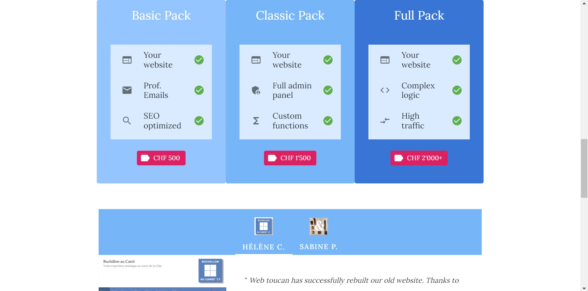
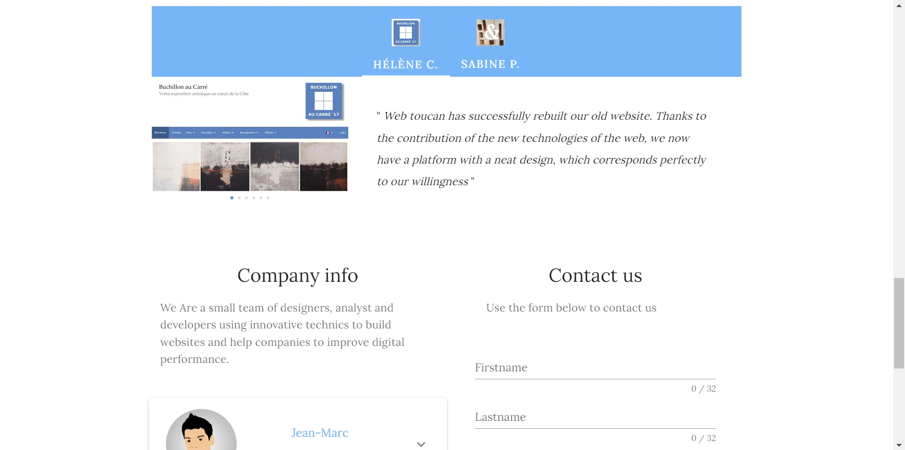

# Web Toucan

A <a href="https://nuxtjs.org/" target="_blank">Nuxt.js</a> version 3 static website. Includes contact form and auto deployment to GitHub Pages on every push to main branch through GitHub Actions. Uses Node version 18.





## Build Setup

```bash
# install dependencies
$ npm install

# serve with hot reload at localhost:3000
# Node v16.20.2
$ npm run dev

# build for production and launch server
$ npm run build
$ npm run start

# generate static project
$ npm run generate
```

For detailed explanation on how things work, check out the [documentation](https://nuxtjs.org).

## Contact form configuration

Sending emails from static websites is not as straightforward as with server-based sites. It is necessary to make use of third party functions. In this case, we use <a href="https://github.com/dwyl/learn-to-send-email-via-google-script-html-no-server" target="_blank">Google Apps Mail</a> which allows sending emails from any static HTML page. Messages are saved in a Google spreadsheet <a href="https://docs.google.com/spreadsheets/d/1LyC2WLXFU7_dV3WaLXtHP99vUANa6UL0qQFL0aD0fYs/edit#gid=0">here</a>.

## Configuration

```code
// Add .nojekyll file to generated output
touch ./.output/.nojekyll
```
## DNS config

## Author

<a href="https://jmkleger.com" target="_blank">Jean-Marc Kleger</a>
